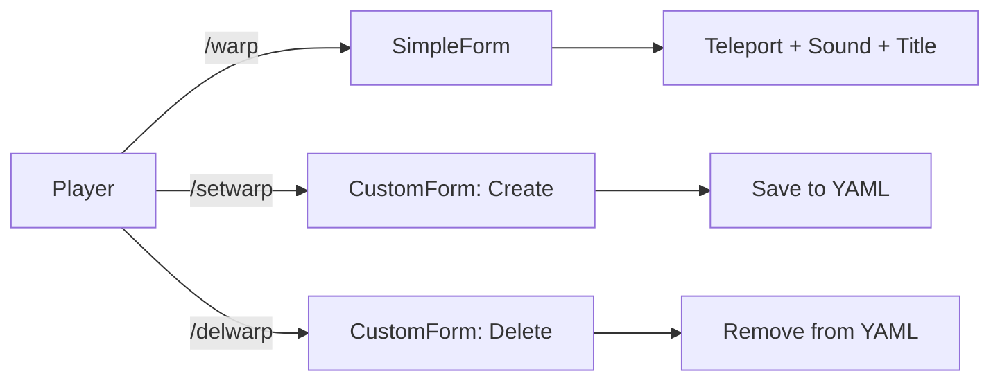

<div align="center">


# ⚡ WarpUI

<p>
  <em>A pixel-perfect warp management experience for PocketMine-MP</em>
</p>

<p>
  
  
  
</p>

<p>
  
  
  
  
</p>

<hr style="height: 2px; background: linear-gradient(to right, transparent, #7c3aed, transparent); border: none;">

</div>

---

<div align="center">

## 📸 Gallery

<p><em>Click on any image to open it right here</em></p>

</div>

<!-- 
  ╔══════════════════════════════════════╗
  ║     CSS MODAL SYSTEM (Pure CSS)     ║
  ╚══════════════════════════════════════╝
-->
<style>
/* Container */
.gallery {
  display: flex;
  flex-wrap: wrap;
  justify-content: center;
  gap: 15px;
  padding: 20px;
}

/* Image cards */
.gallery-card {
  position: relative;
  width: 220px;
  overflow: hidden;
  border-radius: 16px;
  box-shadow: 0 8px 32px rgba(0,0,0,0.15);
  transition: all 0.4s cubic-bezier(0.175, 0.885, 0.32, 1.275);
  cursor: pointer;
  background: #0d1117;
  border: 1px solid #30363d;
}

.gallery-card:hover {
  transform: translateY(-10px) scale(1.03);
  box-shadow: 0 20px 40px rgba(139, 92, 246, 0.3);
  border-color: #7c3aed;
}

.gallery-card img {
  width: 100%;
  height: 140px;
  object-fit: cover;
  display: block;
  transition: all 0.5s ease;
}

.gallery-card:hover img {
  transform: scale(1.1);
}

/* Labels */
.gallery-label {
  position: absolute;
  bottom: 0;
  left: 0;
  right: 0;
  background: linear-gradient(to top, rgba(0,0,0,0.9), transparent);
  color: white;
  padding: 25px 12px 10px;
  font-size: 14px;
  font-weight: bold;
  text-align: center;
  opacity: 0;
  transition: opacity 0.3s ease;
}

.gallery-card:hover .gallery-label {
  opacity: 1;
}

/* Modal */
.modal {
  display: none;
  position: fixed;
  top: 0;
  left: 0;
  width: 100%;
  height: 100%;
  background: rgba(0,0,0,0.95);
  z-index: 9999;
  justify-content: center;
  align-items: center;
  flex-direction: column;
}

.modal:target {
  display: flex;
}

.modal img {
  max-width: 95%;
  max-height: 85%;
  border-radius: 20px;
  box-shadow: 0 0 80px rgba(139, 92, 246, 0.5);
  animation: zoomIn 0.4s ease;
}

@keyframes zoomIn {
  from { transform: scale(0.5); opacity: 0; }
  to { transform: scale(1); opacity: 1; }
}

.modal-close {
  position: fixed;
  top: 20px;
  right: 30px;
  color: #fff;
  font-size: 40px;
  text-decoration: none;
  transition: all 0.3s ease;
  z-index: 10000;
}

.modal-close:hover {
  color: #7c3aed;
  transform: rotate(90deg);
}

.modal-caption {
  color: #8b949e;
  margin-top: 20px;
  font-size: 16px;
  text-align: center;
}
</style>

<!-- Gallery Grid -->
<div class="gallery">

  <a href="#modal1" class="gallery-card">
    
    <div class="gallery-label">📋 Main Menu</div>
  </a>

  <a href="#modal2" class="gallery-card">
    
    <div class="gallery-label">🌍 Warp List</div>
  </a>

  <a href="#modal3" class="gallery-card">
    
    <div class="gallery-label">✨ Create Warp</div>
  </a>

  <a href="#modal4" class="gallery-card">
    
    <div class="gallery-label">🗑️ Delete Warp</div>
  </a>

  <a href="#modal5" class="gallery-card">
    
    <div class="gallery-label">🚀 Teleport Effect</div>
  </a>

</div>

<!-- Modals -->
<div class="modal" id="modal1">
  <a href="#" class="modal-close">&times;</a>
  
  <p class="modal-caption">📋 <strong>Main Menu</strong> — Clean warp selection interface</p>
</div>

<div class="modal" id="modal2">
  <a href="#" class="modal-close">&times;</a>
  
  <p class="modal-caption">🌍 <strong>Warp List</strong> — All warps at a glance</p>
</div>

<div class="modal" id="modal3">
  <a href="#" class="modal-close">&times;</a>
  
  <p class="modal-caption">✨ <strong>Create Warp</strong> — Customizable titles & messages</p>
</div>

<div class="modal" id="modal4">
  <a href="#" class="modal-close">&times;</a>
  
  <p class="modal-caption">🗑️ <strong>Delete Warp</strong> — Easy dropdown selection</p>
</div>

<div class="modal" id="modal5">
  <a href="#" class="modal-close">&times;</a>
  
  <p class="modal-caption">🚀 <strong>Teleport Effect</strong> — Smooth sounds & titles</p>
</div>

---

<div align="center">

## 🎬 Quick Demo

<table>
<tr>
  <td align="center"><strong>🎥 Creating a Warp</strong></td>
  <td align="center"><strong>🎥 Using /warp</strong></td>
</tr>
<tr>
  <td><em>Coming soon...</em></td>
  <td><em>Coming soon...</em></td>
</tr>
</table>

</div>

---

<div align="center">

## 🧭 Table of Contents

**[📖 Overview](#-overview)** •
**[✨ Features](#-features)** •
**[📥 Installation](#-installation)** •
**[🔧 Commands](#-commands--permissions)** •
**[⚙️ Config](#️-configuration)** •
**[💾 Storage](#-data-storage)** •
**[🧠 Source](#-full-source-code)** •
**[🔧 Fixes](#-troubleshooting--common-errors)** •
**[👤 Author](#-author)**

</div>

---

<div align="center">
  <hr style="height: 2px; background: linear-gradient(to right, transparent, #7c3aed, transparent); border: none;">
</div>

## 📖 Overview

> **WarpUI** transforms the clunky command-based warp system into a **beautiful UI experience**. No more typing long commands — just click, select, and teleport.

<div align="center">

| 🖥️ Form Type | ⚙️ Function | 🎨 Style |
|:-----------:|:----------:|:------:|
| `SimpleForm` | Warp list | Gradient buttons |
| `CustomForm` | Create Warp | Toggle + Input |
| `CustomForm` | Delete Warp | Dropdown select |

</div>

### 🧠 How It Works



---

✨ Features

<table>
<tr>
  <td>
    <ul>
      <li>🖥️ <strong>Interactive GUI</strong> — No commands needed</li>
      <li>⚡ <strong>Instant Teleport</strong> — Zero lag</li>
      <li>🔐 <strong>Permission System</strong> — Full control</li>
      <li>💾 <strong>YAML Storage</strong> — Survives restarts</li>
    </ul>
  </td>
  <td>
    <ul>
      <li>🔊 <strong>Sound Effects</strong> — EndermanTeleportSound</li>
      <li>📝 <strong>Custom Titles</strong> — Per-warp title screen</li>
      <li>💬 <strong>Custom Messages</strong> — Chat messages on teleport</li>
      <li>🧹 <strong>Clean Code</strong> — Well-structured, commented</li>
    </ul>
  </td>
</tr>
</table>

---

📥 Installation

<div align="center">

Step Action Emoji
1 Download WarpUI.phar from Releases 📥
2 Place it in plugins/ folder 📁
3 Restart server 🔄
4 Enjoy! 🎉

</div>

⚠️ Dependency: libFormAPI is required. Make sure it's loaded.

---

🔧 Commands & Permissions

<div align="center">

🎮 Command 📝 Description 🔑 Permission 👤 Default
/warp Open warp menu warpui.use ✅ All
/setwarp Create new warp warpui.create 🔒 OP
/delwarp Delete a warp warpui.delete 🔒 OP

</div>

<details>
<summary><strong>📄 plugin.yml Permission Nodes</strong></summary>
<br>

```yaml
permissions:
  warpui.use:
    description: "Access /warp menu"
    default: true
  warpui.create:
    description: "Create warps"
    default: op
  warpui.delete:
    description: "Delete warps"
    default: op
```

</details>

---

⚙️ Configuration

```yaml
# config.yml — generated on first run

# Main menu title
warp-menu-title: "Warps"

# Button icon (texture path or URL)
warp-icon: "textures/items/compass"
```

💡 Change warp-icon to any Minecraft texture path or leave as default.

---

💾 Data Storage

Warps persist in warps.yml:

```yaml
Hub:
  x: 0.0
  y: 100.0
  z: 0.0
  level: "world"
  title: "§aWelcome!"
  title_enabled: true
  message: "§eYou have arrived at Hub!"
  message_enabled: true

Shop:
  x: 50.5
  y: 65.0
  z: -30.2
  level: "world"
  title: "§6Shop"
  title_enabled: true
  message: ""
  message_enabled: false
```

Field Type Description
x,y,z float Coordinates
level string World folder name
title string Title screen text
title_enabled bool Show title?
message string Chat message
message_enabled bool Show message?

---

🧠 Full Source Code

<details>
<summary><strong>📄 WarpUI.php — Click to expand</strong></summary>
<br>

```php
<?php

declare(strict_types=1);

namespace haedarXD;

use pocketmine\plugin\PluginBase;
use pocketmine\player\Player;
use pocketmine\command\Command;
use pocketmine\command\CommandSender;
use pocketmine\utils\Config;
use pocketmine\world\Position;
use pocketmine\world\sound\EndermanTeleportSound;
use jojoe77777\FormAPI\SimpleForm;
use jojoe77777\FormAPI\CustomForm;
use pocketmine\Server;

class WarpUI extends PluginBase {

    public Config $warps;

    public function onEnable(): void {
        @mkdir($this->getDataFolder());
        $this->saveDefaultConfig();

        if(!file_exists($this->getDataFolder() . "warps.yml")){
            $this->warps = new Config($this->getDataFolder() . "warps.yml", Config::YAML, []);
            $this->warps->save();
        }

        $this->warps = new Config($this->getDataFolder() . "warps.yml", Config::YAML);
    }

    public function onCommand(CommandSender $sender, Command $command, string $label, array $args): bool {
        if(!$sender instanceof Player) return false;

        switch(strtolower($command->getName())){
            case "warp":
                $this->showWarpUI($sender);
                return true;
            case "setwarp":
                $this->showSetWarpForm($sender);
                return true;
            case "delwarp":
                $this->showDelWarpForm($sender);
                return true;
        }
        return false;
    }

    public function showWarpUI(Player $player): void {
        $warps = $this->warps->getAll();
        $title = $this->getConfig()->get("warp-menu-title", "Warps");
        $icon = $this->getConfig()->get("warp-icon", "textures/items/compass");

        $form = new SimpleForm(function(Player $player, $data) use ($warps) {
            if(!is_int($data)) return;
            $keys = array_keys($warps);
            if(!isset($keys[$data])) return;

            $warp = $warps[$keys[$data]];
            $world = Server::getInstance()->getWorldManager()->getWorldByName($warp["level"]);
            if(!$world) return;

            $pos = new Position($warp["x"], $warp["y"], $warp["z"], $world);
            $player->teleport($pos);

            if(($warp["title_enabled"] ?? true) === true)
                $player->sendTitle($warp["title"] ?? "Warped!", "");
            if(($warp["message_enabled"] ?? true) === true && !empty($warp["message"]))
                $player->sendMessage($warp["message"]);

            $player->getWorld()->addSound($player->getPosition(), new EndermanTeleportSound());
        });

        $form->setTitle($title);
        foreach($warps as $name => $warp){
            $form->addButton("§b" . $name . " §a» Go", -1, $icon);
        }
        $player->sendForm($form);
    }

    public function showSetWarpForm(Player $player): void {
        $form = new CustomForm(function(Player $player, $data) {
            if(!is_array($data)) return;

            $name = trim($data[0] ?? "");
            $titleEnabled = (bool)($data[1] ?? true);
            $title = trim($data[2] ?? "");
            $messageEnabled = (bool)($data[3] ?? true);
            $message = trim($data[4] ?? "");

            if($name === "" || isset($this->warps->getAll()[$name])) return;

            $pos = $player->getPosition();

            $this->warps->set($name, [
                "x" => $pos->getX(),
                "y" => $pos->getY(),
                "z" => $pos->getZ(),
                "level" => $player->getWorld()->getFolderName(),
                "title" => $title,
                "title_enabled" => $titleEnabled,
                "message" => $message,
                "message_enabled" => $messageEnabled
            ]);
            $this->warps->save();

            $player->sendMessage("§a✔ Warp §e$name §acreated!");
        });

        $form->setTitle("§l✨ Create Warp");
        $form->addInput("§7Warp Name", "e.g. Shop");
        $form->addToggle("§7Enable Title", true);
        $form->addInput("§7Title Text", "§aWelcome!");
        $form->addToggle("§7Enable Message", true);
        $form->addInput("§7Message Text", "§eYou have arrived!");
        $player->sendForm($form);
    }

    public function showDelWarpForm(Player $player): void {
        $warps = array_keys($this->warps->getAll());

        if(empty($warps)){
            $player->sendMessage("§c❌ No warps to delete.");
            return;
        }

        $form = new CustomForm(function(Player $player, $data) use ($warps) {
            if(!is_array($data) || !isset($warps[$data[0]])) return;

            $name = $warps[$data[0]];
            $this->warps->remove($name);
            $this->warps->save();
            $player->sendMessage("§c🗑 Warp §e$name §cdeleted.");
        });

        $form->setTitle("§l🗑 Delete Warp");
        $form->addDropdown("§7Select warp", $warps);
        $player->sendForm($form);
    }
}
```

</details>

---

🔧 Troubleshooting & Common Errors

<details>
<summary><strong>🔴 "Class FormAPI not found"</strong></summary>
<br>

Error:

```
Class "jojoe77777\FormAPI\SimpleForm" not found
```

Solution:

1. Download libFormAPI
2. Place libFormAPI.phar in plugins/
3. Restart your server
4. Verify it loads before WarpUI

</details>

<details>
<summary><strong>🔴 "No warps to delete"</strong></summary>
<br>

Cause: warps.yml is empty

Solution: Create at least one warp with /setwarp first.

</details>

<details>
<summary><strong>🔴 Teleport fails silently</strong></summary>
<br>

Check:

· World exists and is loaded
· Coordinates are valid
· warps.yml is not corrupted

Debug: Check server console for errors.

</details>

---

📁 Project Structure

```
WarpUI/
├── plugin.yml
├── resources/
│   └── config.yml
├── screenshots/
│   ├── 1.jpg
│   ├── 2.jpg
│   ├── 3.jpg
│   ├── 4.jpg
│   └── 5.jpg
└── src/
    └── haedarXD/
        └── WarpUI.php
```

---

<div align="center">

👤 Author


haedarXD

https://img.shields.io/badge/GitHub-PM--haedarXD-24292e?style=flat-square&logo=github

📧 Report Bug • 💡 Feature Request

</div>

---

📜 License

<div align="center">

```
MIT License — Free to use, modify, and distribute
```

https://img.shields.io/badge/License-MIT-yellow.svg

</div>

---
