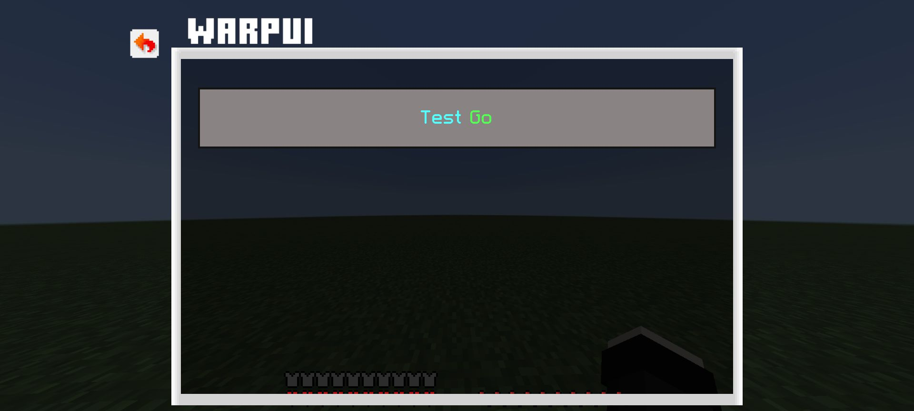
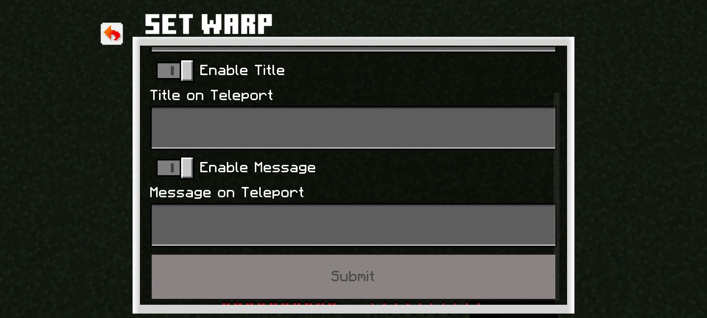
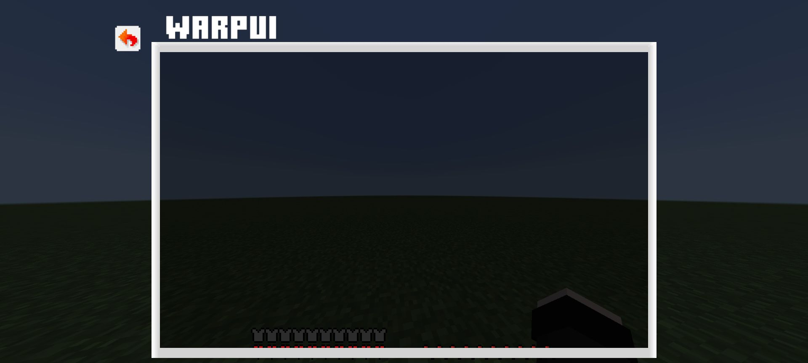
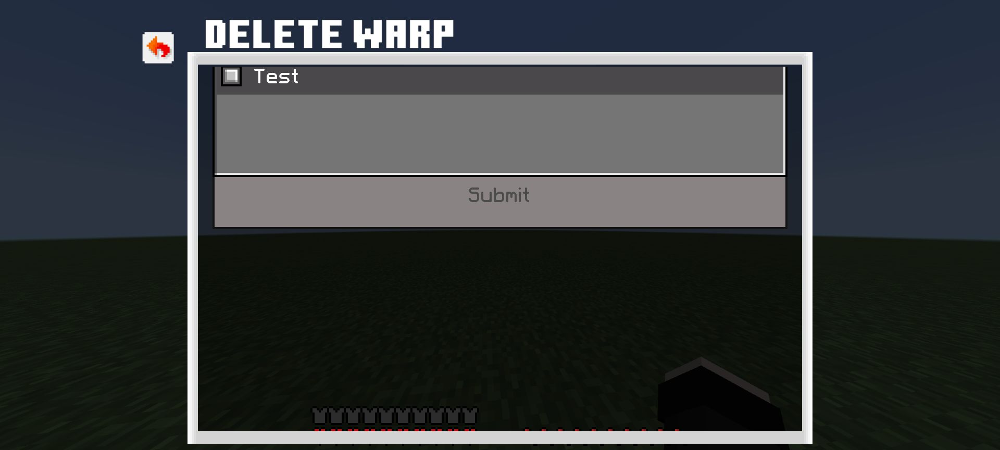
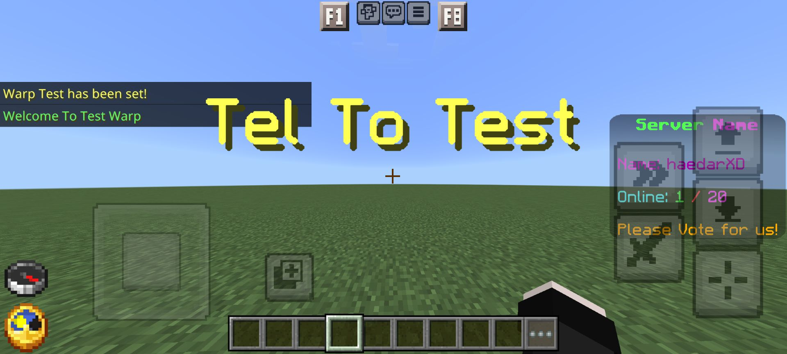

# ⚡ WarpUI

<em>A pixel-perfect warp management experience for PocketMine-MP</em>

  
  
  

  
  
  
  

---

## 📸 Gallery

<em>Click on any image to open it right here</em>

|  |  |  |  |  |
|:---:|:---:|:---:|:---:|:---:|
| 📋 Main Menu | 🌍 Warp List | ✨ Create | 🗑️ Delete | 🚀 Effect |

  <a href="#" style="position:fixed; top:20px; right:30px; color:#fff; font-size:40px; text-decoration:none;">&times;</a>
  
  
📋 Main Menu — Clean warp selection interface

  <a href="#" style="position:fixed; top:20px; right:30px; color:#fff; font-size:40px; text-decoration:none;">&times;</a>
  
  
🌍 Warp List — All warps at a glance

  <a href="#" style="position:fixed; top:20px; right:30px; color:#fff; font-size:40px; text-decoration:none;">&times;</a>
  
  
✨ Create Warp — Customizable titles & messages

  <a href="#" style="position:fixed; top:20px; right:30px; color:#fff; font-size:40px; text-decoration:none;">&times;</a>
  
  
🗑️ Delete Warp — Easy dropdown selection

  <a href="#" style="position:fixed; top:20px; right:30px; color:#fff; font-size:40px; text-decoration:none;">&times;</a>
  
  
🚀 Teleport Effect — Smooth sounds & titles

## 📖 Overview

> **WarpUI** transforms the clunky command-based warp system into a **beautiful UI experience**. No more typing long commands — just click, select, and teleport.

| Form Type | Function | Style |
|:---------:|:--------:|:-----:|
| `SimpleForm` | Warp list | Gradient buttons |
| `CustomForm` | Create Warp | Toggle + Input |
| `CustomForm` | Delete Warp | Dropdown select |

### 🧠 Architecture

graph LR
    A[Player] -->|/warp| B[SimpleForm]
    A -->|/setwarp| C[CustomForm: Create]
    A -->|/delwarp| D[CustomForm: Delete]
    B --> E[Teleport + Sound + Title]
    C --> F[Save to YAML]
    D --> G[Remove from YAML]

## 🧬 Core Methods

### `onEnable()`
Initializes the plugin. Creates data folder if missing, loads `config.yml`, and sets up `warps.yml` storage.

### `onCommand(CommandSender $sender, Command $command, string $label, array $args): bool`
Command router. Returns false for console senders. Routes `/warp`, `/setwarp`, and `/delwarp` to their respective form methods.

### `showWarpUI(Player $player): void`
Builds a `SimpleForm` listing all warps as buttons. On click: validates warp exists → loads world → teleports player → sends title + message + EndermanTeleportSound.

### `showSetWarpForm(Player $player): void`
Builds a `CustomForm` with inputs for warp name, title toggle/text, and message toggle/text. Saves warp data including coordinates and world to `warps.yml`.

### `showDelWarpForm(Player $player): void`
Builds a `CustomForm` with a dropdown of existing warps. On submit, removes selected warp from `warps.yml`. Shows error if no warps exist.

## ✨ Features

| Category | Detail |
|---------|--------|
| 🖥️ GUI | SimpleForm + CustomForm via libFormAPI |
| ⚡ Performance | Direct world lookup, no loops |
| 🔐 Permissions | 3 nodes: `use`, `create`, `delete` |
| 💾 Storage | YAML flat file (`warps.yml`) |
| 🔊 Sound | EndermanTeleportSound on teleport |
| 📝 Title | Per-warp customizable title screen |
| 💬 Message | Per-warp customizable chat message |
| 🛡️ Validation | Empty name check, duplicate prevention, world existence |

## 📥 Installation

| Step | Action |
|:---:|--------|
| 1 | Download from [Releases](https://github.com/PM-haedarXD/WarpUI/releases) |
| 2 | Place `WarpUI.phar` in `plugins/` |
| 3 | Ensure [libFormAPI](https://github.com/jojoe77777/FormAPI) is installed |
| 4 | Restart server |

## 🔧 Commands & Permissions

| Command | Permission | Default |
|---------|-----------|:-------:|
| `/warp` | `warpui.use` | Everyone |
| `/setwarp` | `warpui.create` | OP only |
| `/delwarp` | `warpui.delete` | OP only |

## ⚙️ Configuration

warp-menu-title: "Warps"
warp-icon: "textures/items/compass"

## 💾 Data Format

Hub:
  x: 0.0
  y: 100.0
  z: 0.0
  level: world
  title: "§aWelcome!"
  title_enabled: true
  message: "§eYou have arrived at Hub!"
  message_enabled: true

## 🔧 Troubleshooting

**🔴 Class FormAPI not found**
→ Install [libFormAPI](https://github.com/jojoe77777/FormAPI) in plugins folder.

**🔴 No warps to delete**
→ Create at least one warp with `/setwarp` first.

**🔴 Teleport fails silently**
→ Verify world is loaded and `warps.yml` coordinates are valid.

## 📁 Project Structure

WarpUI/
├── plugin.yml
├── resources/
│   └── config.yml
├── screenshots/
│   ├── 1.jpg
│   ├── 2.jpg
│   ├── 3.jpg
│   ├── 4.jpg
│   └── 5.jpg
└── src/
    └── haedarXD/
        └── WarpUI.php

## 👤 Author

### haedarXD

## 📜 License

MIT — Free to use, modify, and distribute.

  Made with ❤️ for the PocketMine community

